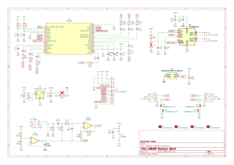
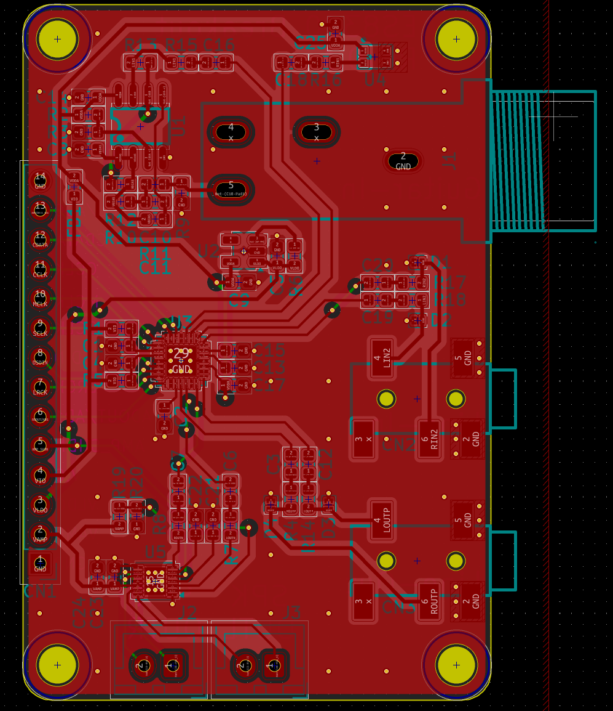
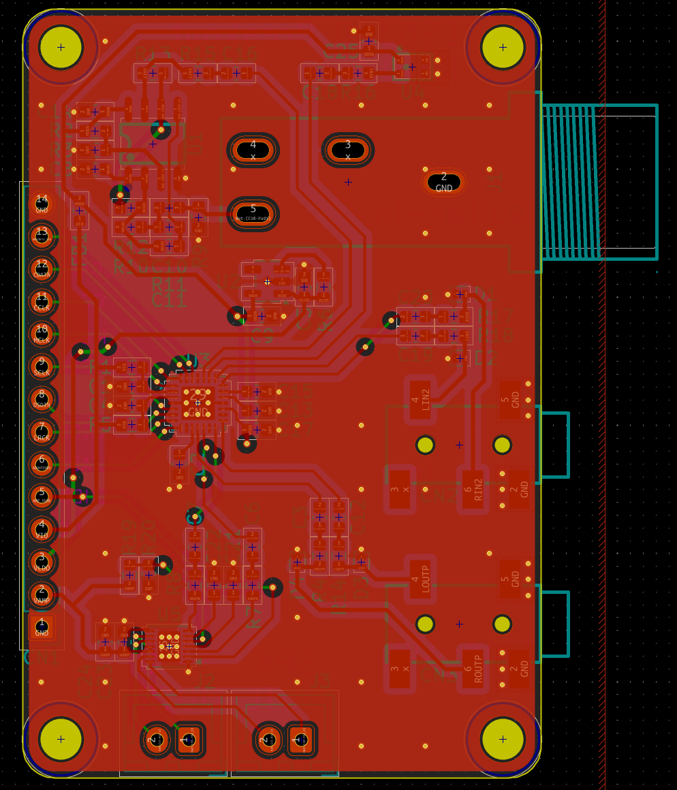
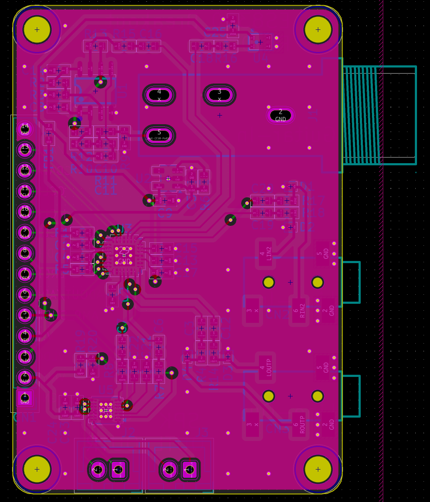
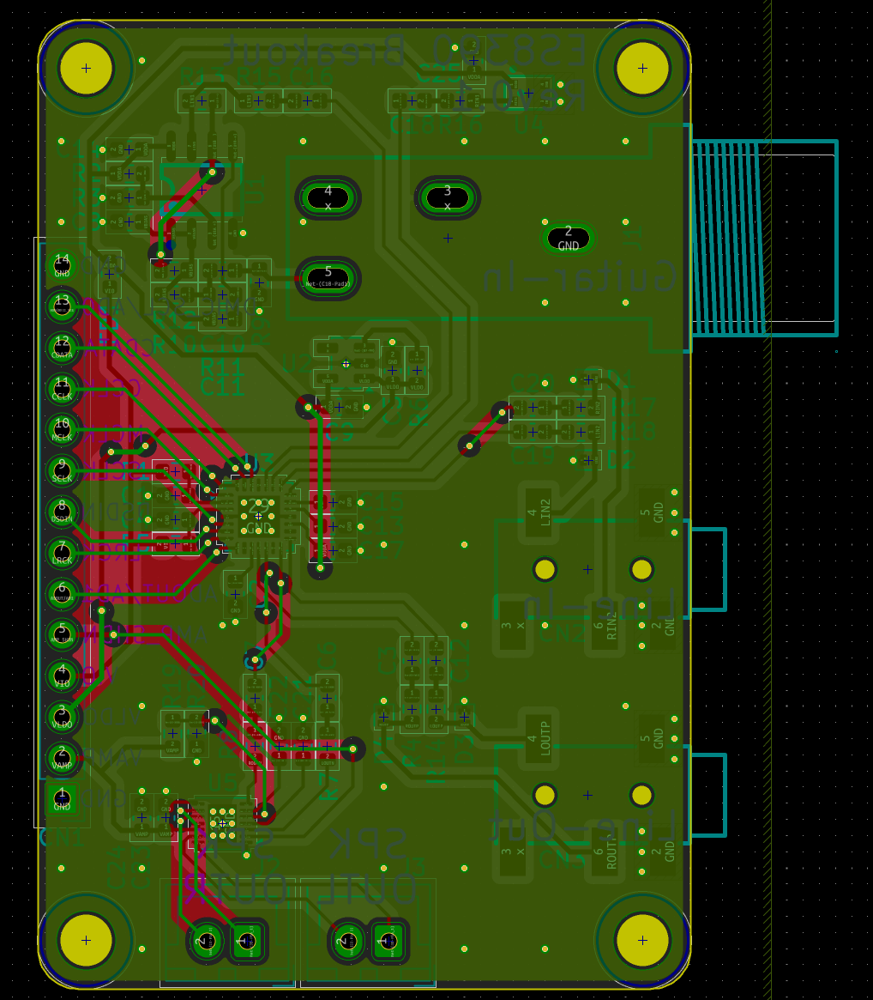
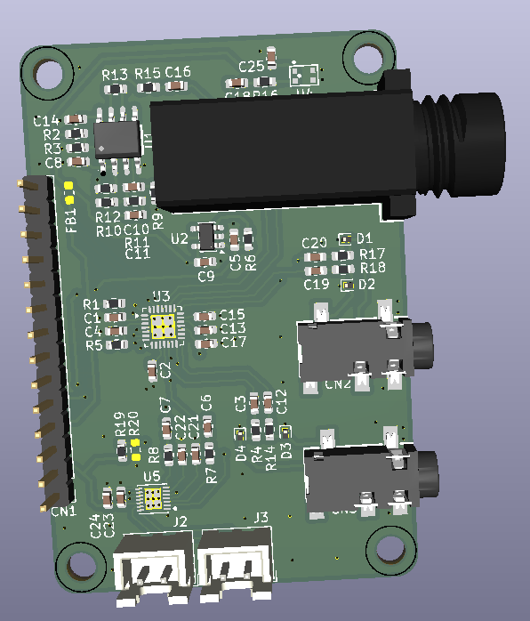

# ES8390 Breakout Board

A KiCad-based ES8390 audio codec breakout board featuring guitar and line inputs, an onboard MEMS microphone, line and amplified stereo speaker outputs.

Tested Features:
- [x] LP5907 3.0V LDO
- [x] ES8390 Audio-Codec
- [x] Line-Out
- [ ] Line-In
- [x] MAX98306 Class D Stereo Amp
- [ ] TLV9062 Guitar Pre-Amp
- [ ] MSM381ACP003 MEMS Microphone
 

## Schematic

## Layout

## 3d View

